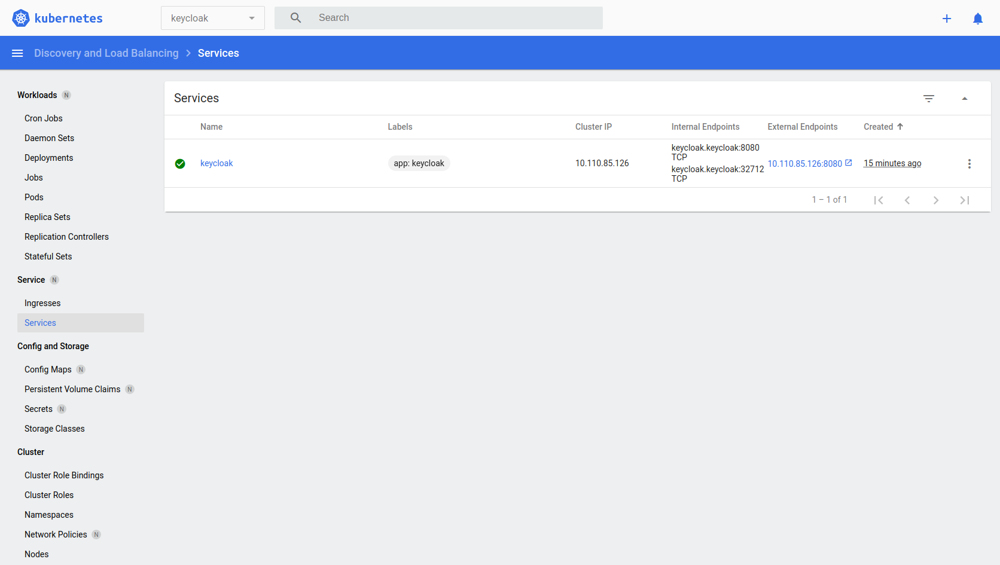
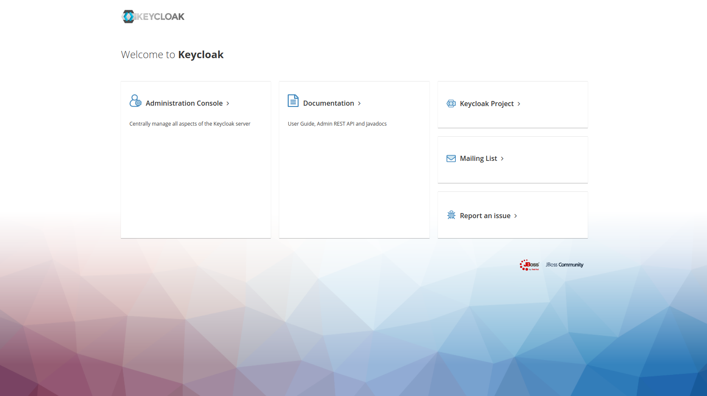
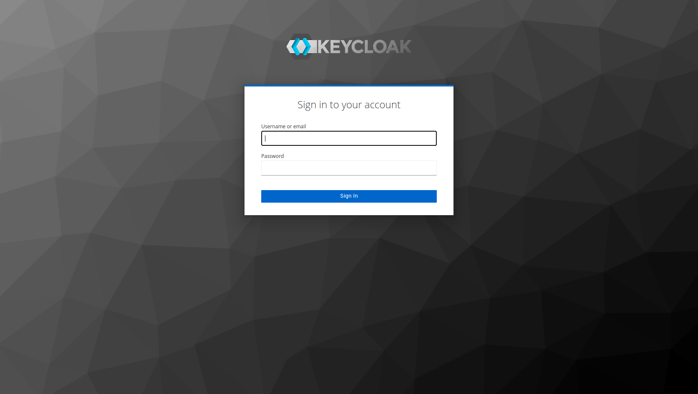
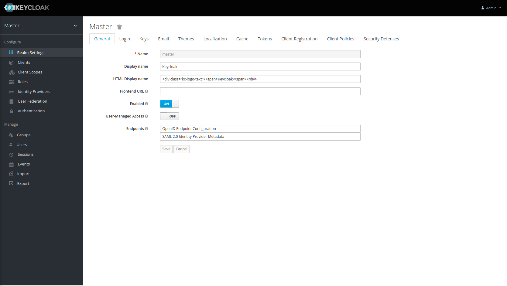

# Description
PoC Deploy Keycloak on Minikube

# Install and start Minikube

```shell
curl -LO https://storage.googleapis.com/minikube/releases/latest/minikube-linux-amd64
sudo install minikube-linux-amd64 /usr/local/bin/minikube

minikube start
```

# Install Kubernetes CLI

```shell
curl -LO "https://dl.k8s.io/release/$(curl -L -s https://dl.k8s.io/release/stable.txt)/bin/linux/amd64/kubectl"
sudo install -o root -g root -m 0755 kubectl /usr/local/bin/kubectl

kubectl version --client
```

# Add minikue addons
We must enable ingress addon on minikube

```shell
minikube addons list
minikube addons enable ingress
```

# Deploy keycloak

```shell
kubectl apply -k keycloak-namespace.yaml
kubectl apply -k keycloak-deployment.yaml
```

# Start minikube tunneling
Start tunneling service to asign ip for the LoadBalancer keycloak service installed

```shell
sudo minikube tunnel
```



# access keycloak UI
By default keycloak create ad admin account **admin/admin** for the keycloak service. Get the Ip from the Keycloak service previously capture. For example:

```shell
http://10.110.85.126:8080/
```

Keycloak Landing Page



Keycloak Login 



Keycloak Dashboard

